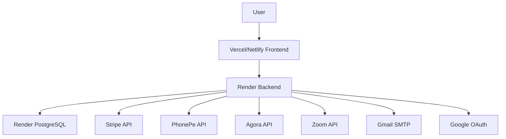

# Deployment Strategy for Unmute Full-Stack Application

## Overview
The Unmute application is a full-stack mentoring platform with video calling capabilities, built using:
- **Backend**: Node.js/Express with PostgreSQL database
- **Frontend**: React application with Tailwind CSS
- **Key Features**: Video calls (Agora/Zoom), payments (Stripe/PhonePe), OAuth (Google), email notifications

## Current Tech Stack Analysis
- **Backend**: Express.js server with PostgreSQL, supports video conferencing, payment processing, and user authentication
- **Frontend**: React SPA with routing, forms, and real-time video components
- **Database**: PostgreSQL hosted on Render
- **External Services**: Stripe, PhonePe, Agora, Zoom, Gmail SMTP, Google OAuth

## Recommended Hosting Platforms

### Backend Hosting
- **Primary Option**: Render (already using for database, supports Node.js)
- **Alternatives**: Heroku, AWS EC2, DigitalOcean App Platform
- **Rationale**: Seamless integration with existing Render PostgreSQL database

### Frontend Hosting
- **Primary Option**: Vercel or Netlify
- **Rationale**: Excellent React support, automatic deployments, CDN, SSL included

### Database
- **Current**: Render PostgreSQL (production-ready)
- **Backup Options**: AWS RDS, Supabase, PlanetScale

## Infrastructure Architecture

## Required Environment Variables

### Production Environment Setup
Create secure environment variables for production:

#### Database
- `DATABASE_URL`: Production PostgreSQL connection string
- `DB_SSL`: true
- `DB_POOL_MIN`: 2
- `DB_POOL_MAX`: 20

#### Authentication
- `JWT_SECRET`: Strong random string (256-bit)
- `REFRESH_TOKEN_SECRET`: Strong random string (256-bit)
- `SESSION_SECRET`: Strong random string
- `GOOGLE_CLIENT_ID`: From Google Console
- `GOOGLE_CLIENT_SECRET`: From Google Console
- `GOOGLE_CALLBACK_URL`: Production callback URL

#### Payment Services
- `STRIPE_SECRET_KEY`: Production Stripe secret key
- `STRIPE_WEBHOOK_SECRET`: Stripe webhook secret
- `PHONEPE_MERCHANT_ID`: Production merchant ID
- `PHONEPE_SALT_KEY`: Production salt key
- `PHONEPE_SALT_INDEX`: Salt index
- `PHONEPE_PAY_API_URL`: Production API URL
- `PHONEPE_STATUS_API_URL`: Production status URL

#### Video Services
- `AGORA_APP_ID`: Agora app ID
- `AGORA_APP_CERTIFICATE`: Agora certificate
- `ZOOM_API_KEY`: Zoom API key
- `ZOOM_API_SECRET`: Zoom API secret
- `ZOOM_ACCOUNT_ID`: Zoom account ID

#### Email & Communication
- `SMTP_HOST`: smtp.gmail.com
- `SMTP_PORT`: 587
- `SMTP_USER`: Gmail address
- `SMTP_PASS`: App password
- `FRONTEND_URL`: Production frontend URL
- `CLIENT_URL`: Production frontend URL

## Step-by-Step Deployment Procedure

### Phase 1: Preparation
1. **Domain Acquisition**: Purchase domain (e.g., unmuteapp.com)
2. **DNS Configuration**: Point domain to hosting providers
3. **SSL Certificates**: Automatic via hosting platforms
4. **Environment Variables**: Set up production env vars securely

### Phase 2: Backend Deployment
1. **Code Preparation**:
   - Ensure all dependencies are production-ready
   - Update CORS origins to production URLs
   - Configure production logging
   - Set up health check endpoints

2. **Render Deployment**:
   - Connect GitHub repository
   - Configure build settings (Node.js)
   - Set environment variables
   - Deploy and verify database connectivity

### Phase 3: Frontend Deployment
1. **Build Configuration**:
   - Update API base URLs to production backend
   - Configure production environment variables
   - Optimize build for production

2. **Vercel/Netlify Deployment**:
   - Connect repository
   - Configure build settings
   - Set environment variables
   - Enable automatic deployments

### Phase 4: CI/CD Pipeline
1. **GitHub Actions Setup**:
   - Backend tests and linting
   - Frontend build and tests
   - Automated deployment on push to main

2. **Branch Protection**:
   - Require PR reviews
   - Run tests before merge

### Phase 5: Monitoring & Security
1. **Logging**: Implement structured logging (Winston/ Morgan)
2. **Error Tracking**: Sentry or similar
3. **Performance Monitoring**: Application performance monitoring
4. **Security**: Rate limiting, input validation, HTTPS enforcement

### Phase 6: Backup & Recovery
1. **Database Backups**: Automated daily backups
2. **Code Repository**: Git versioning
3. **Rollback Strategy**: Quick rollback procedures

## Cost Estimation

### Monthly Costs (Approximate)
- **Render Backend**: $7-25 (depending on usage)
- **Render PostgreSQL**: $7-50 (depending on storage/usage)
- **Vercel Frontend**: $0-20 (hobby/pro plans)
- **Domain**: $10-20/year
- **External APIs**: Variable (Stripe/PhonePe fees, Agora usage)

### One-time Setup Costs
- Domain registration: $10-20
- SSL certificates: Included with hosting
- Development time: Variable

## Risk Mitigation
- **Downtime**: Implement health checks and auto-scaling
- **Data Loss**: Regular backups and testing
- **Security**: Environment variable management, regular updates
- **Performance**: CDN, caching, database optimization

## Post-Deployment Checklist
- [ ] All environment variables configured
- [ ] Database migrations applied
- [ ] Frontend builds successfully
- [ ] API endpoints responding
- [ ] Payment flows tested
- [ ] Video calling functional
- [ ] Email notifications working
- [ ] SSL certificates valid
- [ ] Domain DNS propagated
- [ ] Monitoring tools configured
- [ ] Backup procedures tested

## Maintenance Plan
- **Weekly**: Monitor logs and performance metrics
- **Monthly**: Security updates and dependency checks
- **Quarterly**: Full backup testing and disaster recovery drills
- **Annually**: Infrastructure review and cost optimization

This strategy provides a robust, scalable deployment approach for the Unmute application with minimal downtime and maximum reliability.